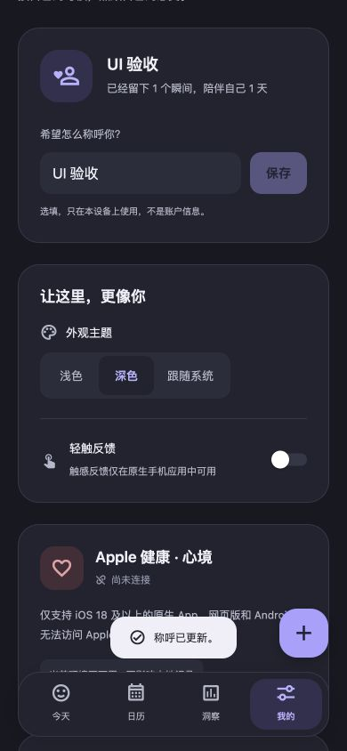
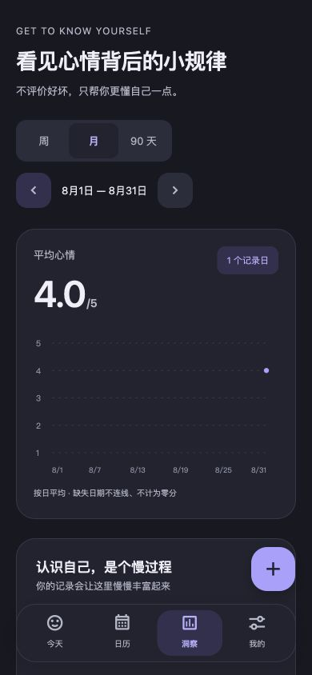
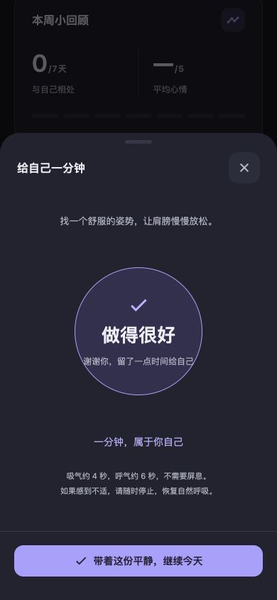
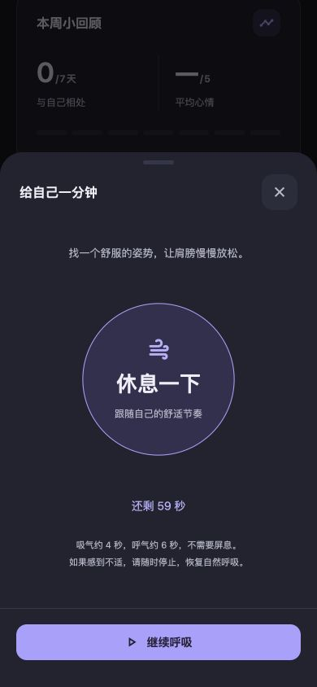

# iOS 交互检查与修复 · 2026-09-07

本轮已修改源码，尚未生成或发布新的 iOS 安装包。检查覆盖首页记录、三步表单、补记、详情编辑与删除确认、日历、洞察、设置和呼吸练习。

## 本次反馈调整

- 记录笔记提示改为「愿意告诉我，刚刚发生了什么吗？」。
- 点叉直接关闭，不保留未保存输入、不自动保存。旧截图中的退出确认已移除。
- 「我的」页保留设置、健康连接、备份等功能卡片，隐私及本地保存说明改为页尾小字和可展开详情。
- 首页呼吸练习使用普通功能卡片，移除独立装饰性寄语；有连续记录时仅显示简短数据提示。
- 洞察移除里程碑卡片，保留实际记录天数和图表；计算方法改为可展开的小字说明。
- 已在 390 × 844 网页预览检查笔记提示、直接关闭、重新打开及说明展开。iOS 原生外观仍以真机验收为准。

## 检查范围与证据边界

### 标签切换叠页修复

- 复现「日历 → 洞察」后，首页和日历虽然已标为非当前页，祖先节点仍为 `display: flex`，透明场景背景使旧内容透出。网页端默认没有启用 `react-native-screens`，导航退回普通 View，只降低旧页面层级。
- 在应用初始化时显式启用 screens，并启用导航的非当前页分离。保留透明背景和页面状态，由 Screen 根据活动状态隐藏旧页面。
- 在宽屏和 390 × 844 预览中往返切换四个标签，逐次检查页面标题祖先的实际显示状态，始终只有当前页可见。日历翻到 8 月，切至洞察再返回仍保留 8 月；测试后恢复当前月份。
- TypeScript、179 项业务 / 原生配置测试、19 项 Web 测试、Web 构建和 iOS Hermes 导出通过。尚未执行 iOS 真机切换验收。


### 原交互检查边界

- 当前机器只有 Command Line Tools，没有 Xcode / `simctl`。因此没有把网页截图当成 iOS 真机截图，也没有声称 Swift 编译、软键盘、系统滚轮、VoiceOver 或 HealthKit 已在真机通过。
- 在 Codex 内置浏览器中实际操作本次构建，使用独立的本地端口和合成记录；未修改已有线上或手机日记。检查了 390 × 844 与 320 × 568 的界面、浅色与深色表单。
- 另建仅使用 React 内存的交互夹具，测试保存失败、重试、慢速保存、草稿退出和详情。打包检查确认夹具不包含真实存储、健康服务或生产上下文。夹具图标是既有测试替身，不能用来验收原生图标或系统选择器外观。
- 截图均来自本次实际操作，保存于 `artifacts/ios-ui-audit/`。截图中的文字日记全部是合成样本。

## 已处理的问题

| 问题                                       | 修改后的行为                                                                        | 验证情况                                                                                            |
| ------------------------------------------ | ----------------------------------------------------------------------------------- | --------------------------------------------------------------------------------------------------- |
| 日期、时间使用普通文本框                   | iOS 点击后展开系统滚轮，提供“完成”；Android 使用系统对话框；网页使用日期 / 时间控件 | 已确认源码接入、Expo 自动链接和 iOS Hermes 导出；网页选定时间与实际保存详情一致。iOS 系统 UI 待真机 |
| 记录中途关闭需要二次确认                   | 按本次用户反馈，点叉直接关闭并丢弃未保存输入；已保存的记录不变                      | 网页填写笔记后关闭无确认，重新打开笔记为空，记录总数不变                                            |
| 日历翻月后，列表与补记仍指向原日期         | 翻月同步选中目标月份的日期；短月份和当前日期做边界限制                              | 实际操作与闰年、跨年、月底回归通过                                                                  |
| 保存中还能改字段、关闭弹窗，忙碌状态不明确 | 保存中冻结心情、活动、笔记与时间控件，禁用退出和重复提交，显示“正在保存…”           | 8 秒延迟夹具检查通过，保存调用次数与记录数正确                                                      |
| 日期控件显示已改但状态未及时更新           | 同时处理日期 / 时间控件的 input 和 change 事件                                      | 最终生产预览保存为 2026-08-31 09:05；详情与搜索均显示该时间                                         |
| iOS 多行笔记缺少方便的收键盘入口           | 弹窗显示“收起键盘”，支持拖动收起；页面随键盘避让，输入时隐藏浮动导航                | 已检查实现与资源打包；软键盘、刘海与 Home Indicator 待真机                                          |
| 详情关闭和编辑弹窗在同一时刻发生           | iOS 等待详情 Modal 的 `onDismiss` 后再打开编辑                                      | 网页编辑流程通过；iOS 动画衔接待真机                                                                |
| 部分分段、筛选和跳过按钮过小               | 分段、心情筛选和跳过按钮高度至少 44；调整日历横向留白与页面底部空间                 | 手机尺寸下无横向溢出，底部操作可访问；320px 七列日历的单日宽度仍不足 44，需结合真机可用性评估       |
| 设置、洞察的移动布局仍沿用桌面纵向 flex    | 手机按内容展开；称呼保存后规范化并收起键盘，保存期间偏好控件真实禁用                | 页面、主题和称呼保存点验通过；原生布局待真机                                                        |

选择器采用 Expo SDK 54 对应的 `@react-native-community/datetimepicker` 8.4.4，保留应用现有身份与最低 iOS 版本。参考：[Expo SDK 54 官方文档](https://docs.expo.dev/versions/v54.0.0/sdk/date-time-picker/)、[组件 8.4.4 文档](https://github.com/react-native-datetimepicker/datetimepicker/blob/v8.4.4/README.md)。iOS 详情衔接使用 [React Native Modal 的 onDismiss](https://reactnative.dev/docs/0.81/modal#ondismiss)。

## 流程验收

1. **首页 → 选择心情 → 三步记录：通过网页验收。** 按后续用户反馈，点叉直接关闭，不再显示放弃确认。填写笔记后关闭、重新打开为空，未增加记录；保存过程仍保留重复提交保护。
2. **笔记 → 日期 / 时间 → 保存 / 重试：通过网页与内存夹具验收。** 空日期拒绝保存；失败保留全部输入；重试成功；慢速保存期间操作禁用。选择 8 月 31 日 09:05，最终记录确实落在该日该时。
3. **详情 → 编辑 / 删除确认：网页验收通过，iOS 衔接待真机。** 编辑保留原记录时间；未修改时间的保存不会重置时间；取消删除后记录仍在。本轮没有删除用户真实数据，底层删除由既有存储回归覆盖。
4. **日历 → 翻月 → 年像素 → 搜索：通过。** 9 月翻到 8 月，补记日期同步到 8 月；从 8 月 31 日回到当月会限制到今天；年像素进入目标月份；跨日期搜索能找到正确补记。
5. **设置 → 称呼 / 主题 / 备份入口：已检查。** 去除称呼两端空格，保存后按钮禁用；深色切换正常；不可用平台的健康提示清楚。备份入口与合并说明已检查，未执行 iOS 文件选择、分享面板或真实健康授权。
6. **洞察 → 周 / 月切换：通过。** 当前无记录周期显示空状态，上一月的合成记录显示 1 个记录日和 4.0 均分；未虚构关联数据。
7. **呼吸 → 开始 / 暂停 / 继续 / 完成：通过网页验收。** 实际跑完 60 秒并出现完成按钮；暂停后保留剩余秒数，继续入口可用。原生后台切换仍待真机。

## 截图

### 原问题：普通日期、时间输入框


### 修复后：专用网页控件，保存详情与选择一致

这是网页验证截图，iOS 分支使用系统滚轮，外观不同。


### 保存失败


### 320 像素深色表单


### 其他主要流程







## 自动检查与复现

- `npm run verify`：TypeScript、179 项业务 / 原生配置测试、Web 导出、19 项 Web 发布测试通过，共 198 项。
- 新增日期与时间测试另外在 `TZ=America/New_York` 下通过，涵盖保留本地日期、午夜时间、过去日期、未来时间拒绝、闰年与月末。
- `expo-modules-autolinking react-native-config --platform ios --json`：确认安装包依赖图包含 RNDateTimePicker 8.4.4 的 podspec。
- `MOODTRACKER_BUILD_TARGET=native npx expo export --platform ios`：iOS Hermes 资源导出通过；这是 JavaScript 打包，不是 Xcode 原生编译或安装包。
- `scripts/verify-ios.sh` 已增加对 RNDateTimePicker CocoaPods target 的检查；本机缺少 Xcode，该原生编译脚本本轮未执行。
- `git diff --check`：通过。

交互夹具可用以下命令重新打开，终端会打印隔离地址：

```sh
node scripts/verify-timeline-ui.mjs --interactions
```

原有健康时间线夹具仍使用不带参数的命令。

## iPhone 验收仍需完成

重新构建包含 RNDateTimePicker 的原生安装包后，重点检查：iOS 15.1+ / 18+ 的滚轮、过去日期深夜时间、今天的未来时间限制；中文键盘与多行笔记；小屏设备及大号系统字体；刘海与 Home Indicator；详情反复进入编辑；VoiceOver 的标签、选择器与双指返回；分享与文件选择、HealthKit 授权与后台恢复。

新增原生依赖需要重新构建 App，单独更新网页或 JavaScript 不能使旧安装包获得该原生组件。本轮未上传 TestFlight，也未改动已有发布状态。
